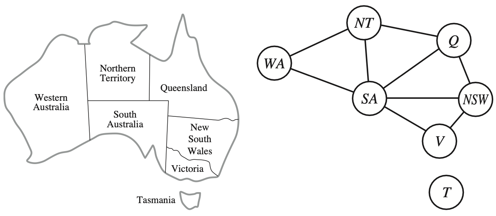

Csp-Js
---
**This library is for educational purposes only. it is suboptimal and not ready for production.**
#### Means of CSP
> A way to solve a wide variety of problems more efficiently: 
> A factored representation for each state: a set of variables, each of which has a value. 
> A problem is solved when each variable has a value that satisfies all the constraints on the variable. 
> A problem described this way is called a constraint satisfaction problem, or CSP.
#### How it works?
> CSP search algorithms take advantage of the structure of states and use general-purpose rather than 
> problem-specific heuristics to enable the solution of complex problems. 
> The main idea is to eliminate large portions of the search space all at once by identifying 
> variable/value combinations that violate the constraints.
> [From 'Artificial Intelligence: A Modern Approach'].
#### Example:

The principal states and territories of Australia. Coloring this map can be viewed as a constraint satisfaction problem (CSP). 
The goal is to assign colors to each region so that no neighboring regions have the same color.
```javascript
const m1 = new Model([
    // Initial map state: Only 'SA' region has a color assignament
    new Variable( 'SA', 'R' ),
    new Variable( 'WA', undefined ),
    new Variable( 'NT', undefined ),
    new Variable( 'Q', undefined ),
    new Variable( 'NSW', undefined ),
    new Variable( 'V', undefined ),
    new Variable( 'T', undefined ),
], [
    // Possible domain values for each variable 
    // ('SA' region has some pruned values due to the early assignement).
    new Domain('SA',  [ 'R' ], ['G', 'B'], [] ),
    new Domain('WA',  [ 'R', 'G', 'B' ], [], [] ),
    new Domain('NT',  [ 'R', 'G', 'B' ], [], [] ),
    new Domain('Q',  [ 'R', 'G', 'B' ], [], [] ),
    new Domain('NSW',  [ 'R', 'G', 'B' ], [], [] ),
    new Domain('V',  [ 'R', 'G', 'B' ], [], [] ),
    new Domain('T',  [ 'R', 'G', 'B' ], [], [] ),
], [
    // Neighbors relationships
    new Relationship('SA', [ 'WA', 'NT', 'Q', 'NSW', 'V'] ),
    new Relationship( 'WA', [ 'SA', 'NT' ] ),
    new Relationship( 'NT', [ 'SA', 'WA', 'Q' ] ),
    new Relationship( 'Q', [ 'NT', 'NSW', 'SA' ] ),
    new Relationship( 'NSW', [ 'SA', 'Q', 'V' ] ),
    new Relationship( 'V', [ 'SA', 'NSW' ] ),
    new Relationship( 'T', [ ] ),
], [
    (iDVal, jDVal) => {
        return iDVal !== jDVal;
    }
]);

const bt1 = Backtracking(m1, FirstUnassignedVariableStrategy, UnorderedDomainValuesStrategy, NoInference);
const prettyModel = JSON.stringify(m1.variables, undefined, 2);
console.log(`Resolved: ${bt1}`);
console.log(`Model: ${prettyModel}`);
```
#### Output:
```shell
Resolved: true
Model: [
  {
    "value": "R",
    "key": "SA"
  },
  {
    "value": "G",
    "key": "WA"
  },
  {
    "value": "B",
    "key": "NT"
  },
  {
    "value": "G",
    "key": "Q"
  },
  {
    "value": "B",
    "key": "NSW"
  },
  {
    "value": "G",
    "key": "V"
  },
  {
    "value": "R",
    "key": "T"
  }
]
```
